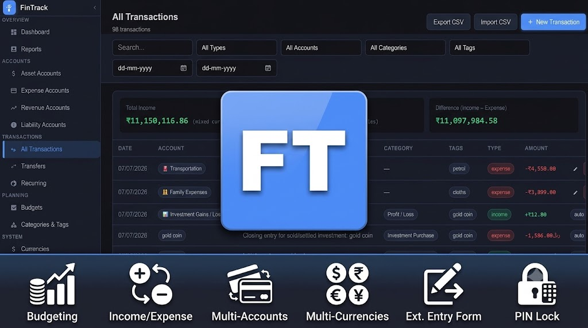

  

<h1 align="center">FinTrack</h1>

<b>A full-featured personal finance manager, built as a Nextcloud app.</b>

  
  
  

Track accounts, income and expenses, transfers, budgets, and recurring
transactions — with full multi-currency support — all stored in your own
Nextcloud database. No third-party servers, no subscriptions, no ads.

---

## Table of contents

- [Features](#features)
- [Screenshots](#screenshots)
- [Installation](#installation)
- [Getting started](#getting-started)
- [Feature guide](#feature-guide)
  - [Accounts](#accounts)
  - [Transactions](#transactions)
  - [Transfers](#transfers)
  - [Recurring transactions](#recurring-transactions)
  - [Budgets](#budgets)
  - [Categories & tags](#categories--tags)
  - [Multi-currency](#multi-currency)
  - [Dashboard & reports](#dashboard--reports)
  - [CSV import / export](#csv-import--export)
  - [External entry form & API](#external-entry-form--api)
  - [App Lock (PIN)](#app-lock-pin)
  - [Settings, backup & reset](#settings-backup--reset)
- [REST API](#rest-api)
- [Data & privacy](#data--privacy)
- [Requirements](#requirements)
- [Contributing](#contributing)
- [Support](#support)
- [License](#license)

---

## Features

- 🏦 **Asset, Liability, and Expense accounts** — track bank/cash balances alongside spending-category buckets
- 💸 **Income & expense transactions** with categories, tags, notes, and multi-currency amounts
- 🔁 **Inter-account transfers** with automatic currency conversion and fuzzy account search
- ⏱ **Recurring transactions** (daily / weekly / monthly / yearly), posted automatically in the background
- 📊 **Budgets** with per-category progress tracking
- 🏷 **Categories and tags**, with rule-based auto-categorization on CSV import
- 🌍 **Multi-currency support**, with per-transaction exchange-rate snapshots so past transactions never silently re-price when a rate changes later, plus [Frankfurter](https://api.frankfurter.dev) (free, no key) and [exchangerate.host](https://exchangerate.host) (fallback, free key) for online rate lookups, covering currencies like SAR and AED that the free tier alone doesn't
- 📈 **Dashboard & reports** — spending by category, monthly trends, asset allocation, upcoming recurring items due in the next 5 days
- 📥 **CSV / JSON import & export**, with automatic duplicate detection and a preview table before you commit
- 🔗 **External entry form & token API** — add transactions from a phone home-screen shortcut, browser bookmarklet, or a script, without logging into Nextcloud
- 🔒 **Optional app-local PIN lock**, layered on top of your Nextcloud login, with session timeout, lockout after repeated failures, and an admin-assisted reset flow if you forget it
- 💾 **Automatic backup to Nextcloud Files** before any full data reset
- 🗄 **All data stored in your own Nextcloud database** — nothing leaves your server except optional exchange-rate lookups

## Screenshots

  

## Installation

1. Open **Nextcloud → Apps → Tools**, search for **FinTrack**, and click **Download and enable**.
   - Or install manually: download the latest release from the [GitHub repo](https://github.com/cloudsliberty/fintrack), extract it into your Nextcloud `apps/` directory as `apps/fintrack`, then enable it under **Settings → Apps**.
2. Requires **Nextcloud 32**.
3. Open FinTrack from the Nextcloud app menu.

## Getting started

1. **Add an account** — go to *Accounts*, choose a type (Asset, Liability, or Expense) and currency.
2. **Set your base currency** — *Settings → Currencies* — this is the currency all cross-account totals are shown in.
3. **Add a transaction** — *Transactions → Add* — pick an account, amount, category, and (optionally) tags and notes.
4. Optional next steps: set up a [budget](#budgets), a [recurring transaction](#recurring-transactions), the [external entry form](#external-entry-form--api) for quick mobile entry, or an [App Lock PIN](#app-lock-pin).

## Feature guide

### Accounts

Four account types, each serving a different purpose:

| Type | Use for |
|---|---|
| **Asset** | Bank accounts, cash, savings, investments — anything you own |
| **Liability** | Credit cards, loans — anything you owe |
| **Revenue** | Income-source buckets (e.g. "Salary", "Freelance") for income-tracking without a real linked account |
| **Expense** | Spending-category buckets (e.g. "Groceries", "Rent") for expense-tracking without a real linked account |

Each account has its own currency, icon, and color, and can be archived
(marked inactive) without deleting its transaction history.

### Transactions

Income or expense entries against an account: amount, description,
category, tags (free-text, autosuggested from previously used tags),
notes, and date. Foreign-currency accounts can carry a per-transaction
**conversion rate**, frozen at entry time, so editing your currency table
later never silently re-prices historical transactions.

### Transfers

Move money between two accounts in one step. If the accounts use
different currencies, FinTrack converts the amount automatically (with an
editable rate) and records both legs. Account pickers support fuzzy
search for people with many accounts.

### Recurring transactions

Set up a transaction template with a frequency (daily / weekly / monthly
/ yearly) and FinTrack posts it automatically on schedule in the
background — no need to open the app on the due date. The Dashboard
surfaces everything due in the next 5 days so nothing is a surprise, and
you can post an occurrence manually early if needed.

### Budgets

Set a spending limit per category (or overall) for a monthly or custom
period, in any currency, and track progress with a live progress bar as
transactions come in.

### Categories & tags

Categories are typed (income / expense / transfer) and carry an icon and
color. Tags are free-text and shared across all your transactions with
autosuggest. Categories can be exported/imported as a set, or generated
from a sensible built-in default list (Groceries, Rent/Mortgage,
Entertainment, etc.) with one click.

### Multi-currency

Add any number of currencies with a code, symbol, and exchange rate
relative to your base currency. Rates can be entered manually or fetched
online — FinTrack tries [Frankfurter](https://api.frankfurter.dev) first
(free, no API key needed), then falls back to
[exchangerate.host](https://exchangerate.host) (requires a free API key,
set in *Settings → Currency Rate API Key*) for currency pairs Frankfurter
doesn't cover, such as SAR or AED. Every transaction, transfer, and total
correctly distinguishes between "priced in this account's currency" and
"converted to your base currency for reporting" — and conversions always
prefer a transaction's own frozen rate over today's live rate, so past
totals stay stable.

### Dashboard & reports

- Account balances and net worth at a glance
- Income vs. expense trends over time
- Spending broken down by category
- Asset allocation across accounts
- Upcoming recurring transactions due soon
- Filterable transaction reports by account, category, type, and date range

### CSV import / export

Export all transactions to CSV or a full JSON backup. Import a CSV with a
downloadable template as a starting point; FinTrack shows a **column
mapping summary** (which file header matched which field) and a **preview
table** before anything is committed, with duplicate, update, and invalid
rows clearly flagged. Optional rule-based auto-categorization fills in a
category from the description when the file doesn't specify one. Every
row that fails validation is reported individually — row number, the
column that failed, and why — in an Import Results dialog after the
import runs, instead of just a pass/fail count.

Re-importing a file you've exported **updates** matching transactions
instead of duplicating them: each transaction carries a permanent
`unique-key(for-updating)` (its creation time as an epoch-millisecond
number), included automatically in every export. Leave that column blank
on a row to create a new transaction instead.

### External entry form & API

*Settings → External Access* gives you a token and a shareable link that
lets you (or an automation) add transactions **without logging into
Nextcloud** — handy for a phone home-screen shortcut, a browser
bookmarklet, or a script. Authenticated by a single API token rather than
a Nextcloud session. See [REST API](#rest-api) below for the full
request/response format. Both the token and the form link are masked in
Settings and require your App Lock PIN to reveal or copy, if one is set.
Opening the link offers to install itself as an app — titled
"FinTrack - `<your-domain>`" with the same icon as the main app, so
multiple instances stay distinguishable on your home screen — with an
explicit Yes / Maybe Later / Cancel choice remembered locally in your
browser.

### App Lock (PIN)

An optional PIN layered on top of your normal Nextcloud login — useful on
a shared device or if your Nextcloud session stays logged in. Includes an
auto-lock timeout after inactivity, lockout after repeated failed
attempts, a self-service security-question reset, and an
admin-approval reset flow for when both the PIN and the security answer
are forgotten.

### Settings, backup & reset

Configure base currency, tags, category rules, the external API token,
and App Lock from one Settings screen. Deleting an account or transaction
always asks for confirmation first — account deletion adds a 3-second
cancellable countdown on top, since it can't be undone. Deleted
transactions aren't gone immediately either: the last 100 land in
**Recently Deleted** (a recycle bin) and can be restored any time, or
purged for good. A full backup is written to Nextcloud Files automatically
before any full data reset, and settings can be restored from a previous
backup.

## REST API

FinTrack exposes two API surfaces:

- **`/api/*`** — the full internal API (accounts, transactions, transfers,
  budgets, categories, currencies, recurring rules, settings, summary).
  Authenticated by your live Nextcloud session; this is what the web UI
  itself uses.
- **`/external/*`** — a smaller, public, **token-authenticated** API
  (`X-FinTrack-Token` header) for quick transaction entry from outside
  Nextcloud — no session or cookies required. Get your token from
  *Settings → External Access*.

Full endpoint list, request/response shapes, and integration examples
(including a ready-to-use spec for building your own client) are in the
[admin manual](docs/MANUAL.md).

## Data & privacy

All data lives in your own Nextcloud database — accounts, transactions,
budgets, and settings never leave your server. The only optional external
calls FinTrack makes are to Frankfurter and/or exchangerate.host for
live exchange rates, and only if you enable online rate lookups;
everything else works fully offline within your Nextcloud instance.

## Requirements

- Nextcloud **32**
- PHP as required by your Nextcloud installation
- No additional services required (exchange-rate API is optional)

## Contributing

Issues and pull requests are welcome at
[github.com/cloudsliberty/fintrack](https://github.com/cloudsliberty/fintrack/issues).

## Support

- 🐛 [Report a bug](https://github.com/cloudsliberty/fintrack/issues)
- 📖 [Admin manual](docs/MANUAL.md)
- ☕ [Donate](https://www.paypal.me/jaleel1618) if FinTrack is useful to you

## License

[AGPL-3.0](LICENSE) — © Abdul Jaleel Adenpulan
